# Sub30s Buddhist Group 

My idea for this project was to develop a concept website for the Sub30s Buddhist Group which I regularly attend. The purpose of the website is to provide some general information on the group (including What we do?, When we meet?, Where we meet?), an introduction into Buddhism and Meditation, and an opportunity to get in touch to request further information.

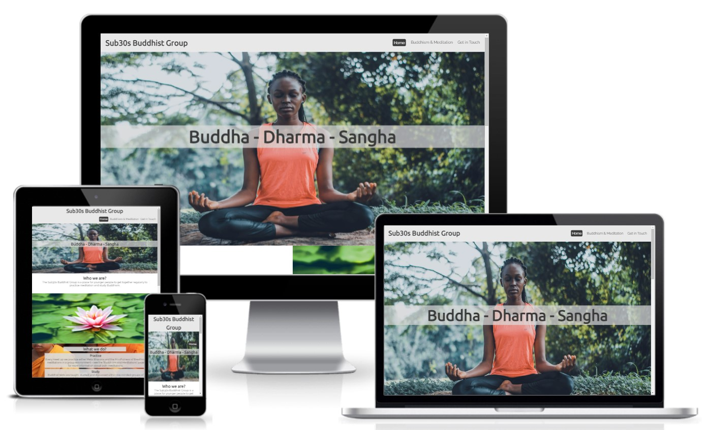

# Table of contents
- [Design](#design)
- [Features](#features)
  - [Existing Features](#existing-features)
    - [Languages Used](#languages-used)
    - [Navigation](#navigation)
    - [Home Page Hero Image](#home-page-hero-image)
    - [Home Page](#home-page)
    - [Footer](#footer)
    - [Buddhism and Meditation](#buddhism-and-meditation)
    - [Get in Touch](#get-in-touch)
  - [Future Features](#future-features)
- [Testing](#testing)
  - [Validator Testing](#validator-testing)
  - [Unfixed Bugs](#unfixed-bugs)
  - [Libraries & Programs Used](#libraries-and-programs-used)
- [Deployment](#deployment)
- [Credits](#credits)
  - [Content](#content)
  - [Media](#media)

# Design

**Text & Background color**

I selected both the text and background colors to keep the website simple. I wanted to keep the main background white and introduce color into the website through the images used. I decided to use a light grey for the header and the footer to provide some contrast from the main sections.

# Features

## Existing Features:

### Languages Used

- HTML5
- CSS3

### Navigation

A three navigation buttons (one per page) have been provided in the top right section of the header to allow for the user to easily locate and use. The location of the navigation buttons change with smaller screens -- these are as such located under the logo due to the smaller screen space available.

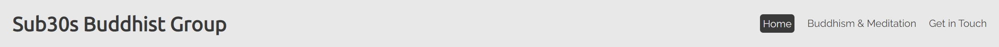

### Home Page Hero Image

A Hero Image is used on the Home Page (only) under the Header. The text over the Hero Image, 'Buddha - Dharma - Sangha', has been added to break up the image and has been included to improve the design. 'Buddha - Dharma - Sangha' are the Three Jewels of Buddhism and are an important part of the teachings.

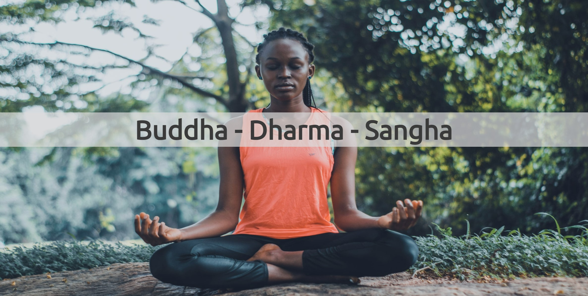

### Home Page

This page provides all the information a user will need about the group. Each of the questions a user may have about the group have been broken into sections to make it easy to read. This section has been kept simple and to the point.

#### Who we are?

This section has been placed first to provide some context about the page and what the group is about.

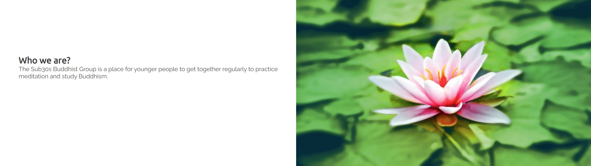

#### What we do?

This section has been added to provide the user with information on what we do during group sessions. Headers have been used to simply state what takes place with a small explanation underneath.

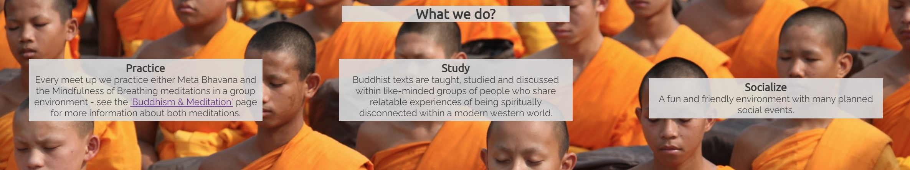

#### When we meet?

This section details the times that the group meets.

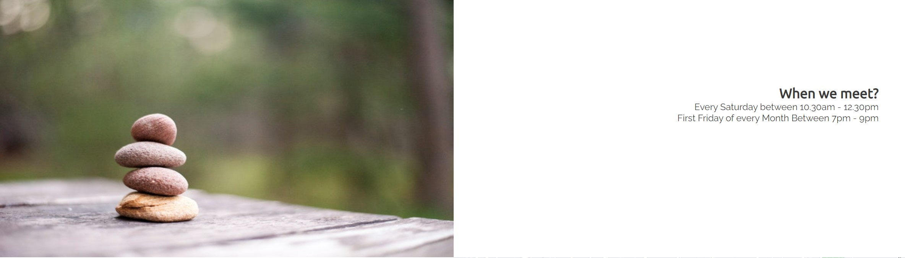

#### Where to find us?

This sections details where the group meets. A postal address has been detailed, with a Google Maps tile for a visual for the location.

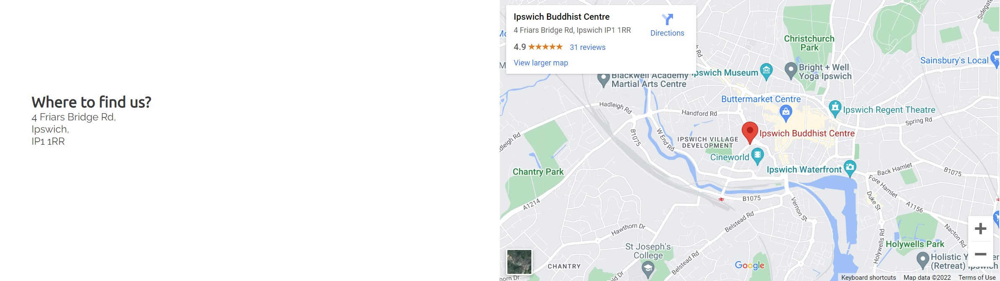

### Footer

The footer section features a note that this site is for educational purposes only and links to four social media sites.

The note regarding this site being for educational purposes only has been included as I do not have the rights to some of the content and media used on the website. The content and media has been credited in this document.

### Buddhism and Meditation

Although the home page provides details of the group, I thought it was important to detail some information about Buddhism which is studied. Screenshots of these sections have been provided below:

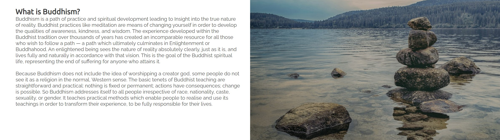

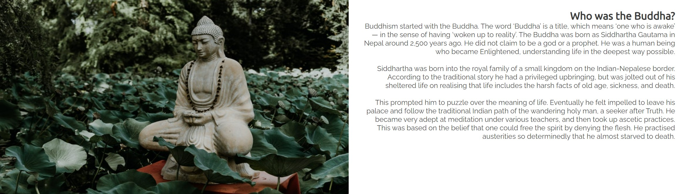

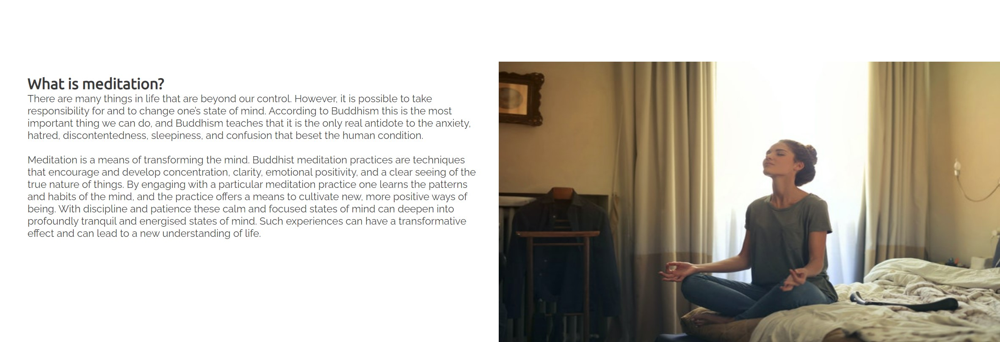

I also want to include some information on the meditations which take place during the group sessions. Instead of image tiles for these sections, I thought it would be better to include videos of the Meditations for users to use for practice. These videos have not been set to autoplay and controls have been provided for good user experience. Screenshots of these sections have been provided below:

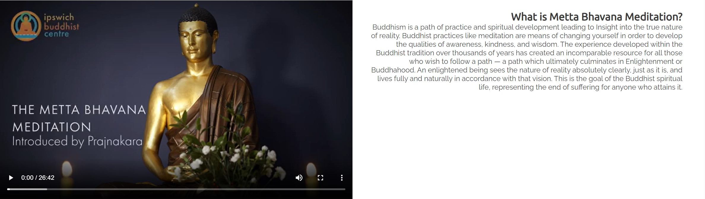

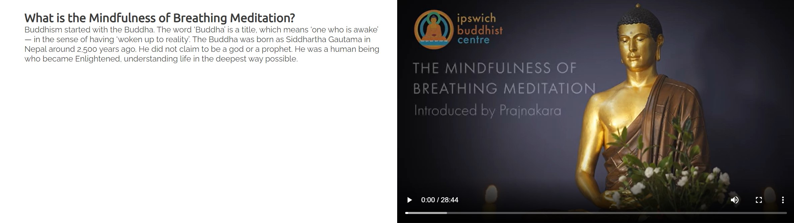

### Get in Touch 

This page allows the user an opportunity to get in contact with the group and find out more information.

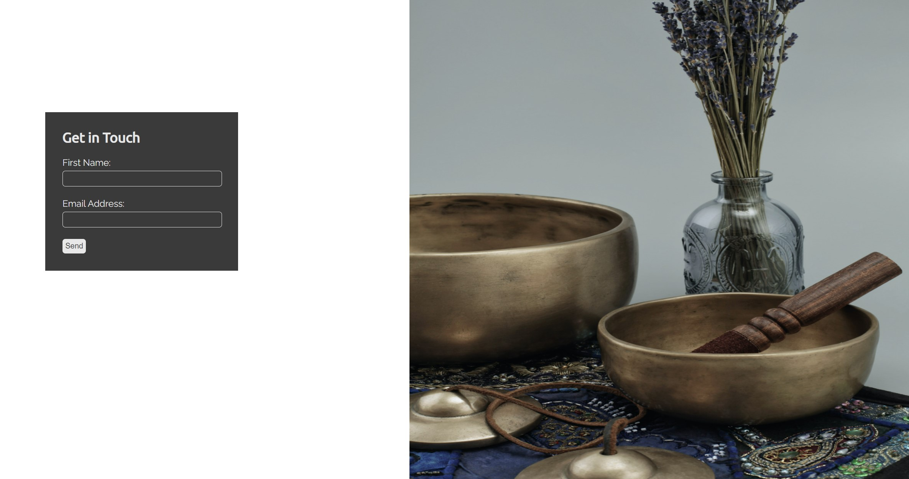

## Future Features

- Provide more information on Buddhism and Meditation
- Gallery of Images from Group Events

# Testing

Testing of the website has been complete by myself and a few friends and family on various devices (Laptop, Tablet and Mobile). It is noted that all of the links, videos, and the contact form (including the input fields requiring information before submitting) functioned as expected.

To ensure that the website worked on a different browser that what was used for the development (Google Chrome), testing also took place on Microsoft Edge.

When I added a feature for the navigation bar to remain static whilst the user scrolled down the page, this intially created an issue with the top of the hero image hidden behind the navigation bar. This was fixed by putting the content of the <header> into a 
 and then styling the height of this to the same as the header section.

A significant amount of time was spent on Google Chrome Dev Tools both for the intial development, media queries styling and testing at various screen sizes. I found that I spent a lot of time with styling and testing of the 'Buddhism and Meditation' Section to ensure that the page worked well on smaller screens.

After completing the first draft of the site, I run the code through the W3C HTML and CSS validators, and the Lighthouse Accessibility Audit. There were only minor changes required for the W3C HTML and CSS validators, but there were some performance improvement which were made as a result of the suggestions from the Lighthouse Accessibility Audit, including:

  - I intially use <iframes> for my YouTube Videos. I found that by downloading the mp4 files and changing the element to a <video> tag, this improved the performance of the site.
  - A minor improvement in the performance score was made from defining the fixed image height in the 'What we do?' section rather than having it as 100%.

## Validator Testing

- HTML: No errors were returned when passing through the official W3C validator:

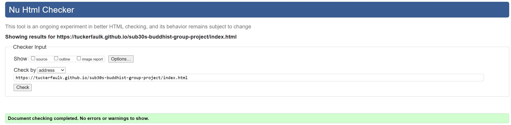

- CSS: No errors were found when passing through the official (Jigsaw) validator:

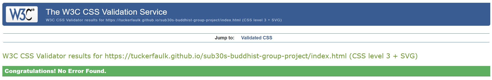

- Lighthouse (Accessibility Audit): The page achieved a great accessibility performance:

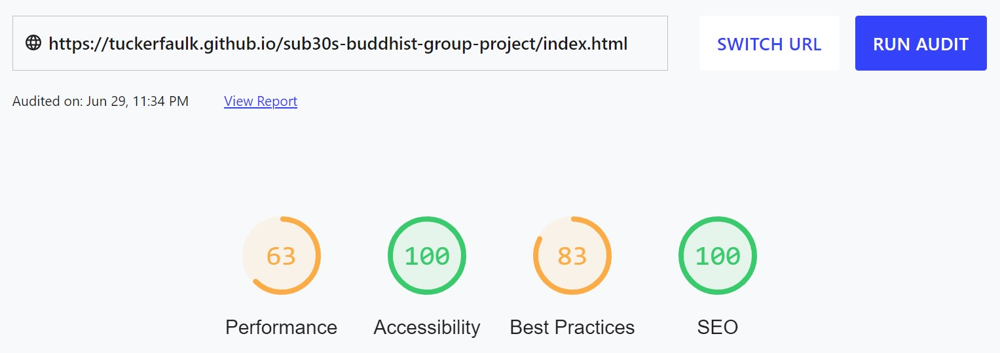

NB: Although the above screenshots only shows the results of the home page, no errors were found on the other pages of the site and they also achieved great accessibility performance.

## Unfixed Bugs

I have found that the spacing below some of the text sections of the 'Buddhism & Meditation' page are quite large. I think that due to the way that I have designed the page by using similar classes for the text tiles to reduce on CSS coding, I had not anticipated that where there are larger blocks of text, that these sections needed to be larger for smaller screens.

I do not think that this takes too much away from the design of the website, and I am happy with how it is, but I do plan to spend some more time on website design in the the future, so I can better plan before a project to avoid this.

It is also noted that the 'Performance' measure from the Lighthouse Accessibility Audit was relatively low (63/100). This is something which I am going to look into so I can improve on it for the future.

## Libraries and Programs Used

- Github: Store Repository
- Gitpod: Create the html and css files
- Google Fonts: Font-family 'Raleway' and 'Ubuntu'
- Google Chrome Dev Tools: To aid the initial styling for media queries and testing at various screen sizes
- Microsoft Edge: Site testing on an alternative browser
- Microsoft OneNote: Planning of the project
- Font Awesome: Social media icons
- Am I Responsive: Screenshots of the final project for the README file

# Deployment

The site was deployed to GitHub pages. The steps to deploy are as follows: 

  1. In the GitHub repository, navigate to the Settings tab. 
  2. From the settings tab, select the 'Pages' tab in the 'Code and Automation' section.
  3. From the source section drop-down menu, select the 'Main' branch.
  4. Once the 'Main' branch has been selected, the page will be automatically refreshed with a detailed ribbon display to indicate the successful deployment. 

The live link for the site can be found here - https://tuckerfaulk.github.io/sub30s-buddhist-group-project/

# Credits

I have really enjoyed the Code Institute course up till now, and I am looking forward to the next units of the course. I wanted to thank the Slack Community for their support learning the content and my Mentor Martina for her guidance with this project and assurances that creating a website is not as scary as I initially thought.

As a starting point I looked at the Coders Coffee and Love Running projects.

- From the Love Running Project, I took inspiration for the header, hero banner, footer and form.
- From the Coders Coffee Project, I took inspiration from in my 'What we do?' section.

## Content

Links have been provided for where the text from the following sections have been taken from:

1. What is Buddhism? [Link](https://thebuddhistcentre.com/buddhism)

2. Who was the Buddha? [Link](https://thebuddhistcentre.com/text/who-was-buddha)

3. What is Meditation? [Link](https://thebuddhistcentre.com/text/meditation)

## Media

Images:

All images were sources from pexels.com:

- Pink Lotus Flower - Photo Contributor: [Pixabay](https://www.pexels.com/photo/aquatic-bloom-blooming-blossom-158465/)
- Rock Formation - Photo Contributor: [nicollazzi xiong](https://www.pexels.com/photo/four-rock-formation-668353/)
- Woman Meditating - Photo Contributor: [Oluremi Adebayo](https://www.pexels.com/photo/woman-meditating-in-the-outdoors-2908175/)
- Monks Meditating - Photo Contributor: [Pixabay](https://www.pexels.com/photo/people-festival-sitting-freedom-50709/)
- Stack of Stones - Photo Contributor: [mali maeder](https://www.pexels.com/photo/stack-of-stones-1278952/)
- Woman Meditating in Bedroom - Photo Contributor: [Andrea Piacquadio](https://www.pexels.com/photo/woman-meditating-in-bedroom-3772612/)
- Buddha Statue - Photo Contributor: [David Bartus](https://www.pexels.com/photo/buddha-statue-2873473/)
- Tibetan Singing Bowls - Photo Contributor: [Magicbowls] (https://www.pexels.com/photo/tibetan-singing-bowls-3543912/)

Youtube Videos:

- [Metta Bahavana Meditation Video](https://www.youtube.com/watch?v=grJ2wh7nk-E)
- [Mindfulness of Breathing Meditation Video](https://www.youtube.com/watch?v=32elVeLKFAI)

